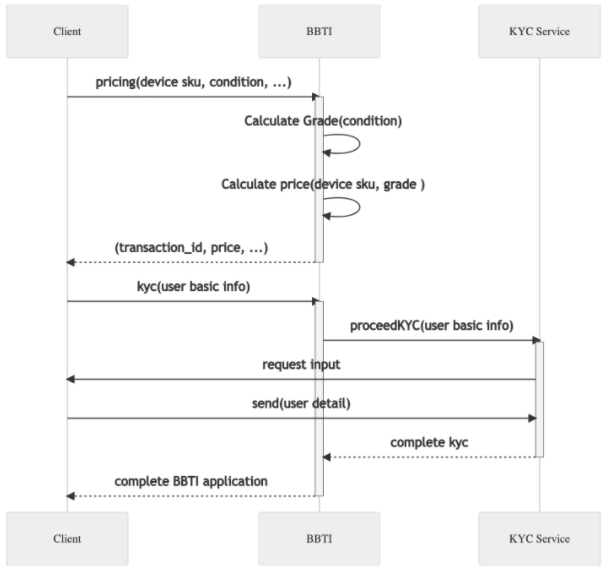

# Belong BBTI API Documentation
This repository contains documentation for developers to use Belong BBTI APIs.

BBTI (Buy-Back, Trade-In) API manages transaction of mobile devices purchase offering. 
The API have endpoints for device registration and user registration.


## About API Disclosure
The BBTI API is currently provided only to trusted partners.

If you are interested in the API please contact us through our [contact page](https://about.belong.co.jp/contact) or our sales representatives.

# APIs
Standard API call flow of BBTI is done through two steps:

1. Send device information including the condition so that calculate grade and price.
1. Send user detail to go through eKYC process.



## Device
Device registration in BBTI API handles basic information (model, storage, sim status) as well as device conditions (status of water damage, LCD, camera, and e.t.c.).   

The API calculate a grade of the device based on the condition, then calculate the price of device. 

```text
${API_SERVER}/bbti/v1/pricing/devices
```

## User
User registration in BBTI handles user information for the registered device in previous step.

The user registration starts an eKYC process. User needs to complete the eKYC by filling out forms in the provided URL.


```text
${API_SERVER}/bbti/v1/user-kyc
```

## Event notification
This endpoint is used to notify an event of BBTI such as application completion.


```text
${API_SERVER}/bbti/v1/transactions/{transaction_id}/event
```

## Further Information.
More API details are described in [here](./sampledata/swagger) as Swagger document.

The API and docs is expected to be changed/enriched in the future.


## Authentication
Authentication is done through API key and secret. Once the contract of API usage is settled, we will provide API key and secret.

API call is done through Bearer Token which can be obtained via API key and secret. 

## Sample
Bearer Token can be obtained by following command.

```shell
curl -H "Authorization: Basic ${CLIENT_AUTH_TOKEN}"  \
   -sS "${AUTH_SERVER}/auth/v1/token"
```

Set the extracted token to auth header and send request.

```shell
curl -H "Authorization: Bearer ${API_AUTH_TOKEN}" -X POST \
 -d '{ "test":"payload"}' \
 ${API_SERVER}/bbti/v1/pricing/devices
```


# License
This project is licensed under the Apache-2.0 License.

