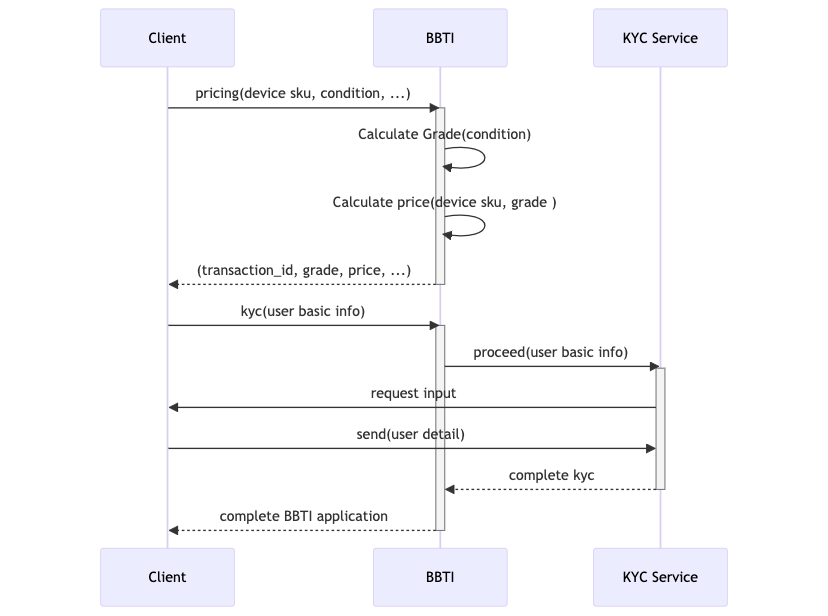

# Belong BBTI API Documentation
This repository contains documentation for developers to use Belong BBTI APIs.

BBTI (Buy-Back, Trade-In) API manages transaction of mobile devices purchase offering.  
The API has endpoints for device registration, user registration, model list fetching, and price calculation.


## About API Disclosure
The BBTI API is currently provided only to trusted partners.

If you are interested in the API please contact us through our [contact page](https://about.belong.co.jp/contact) or our sales representatives.

# Integration Steps Overview

## [1] Get the model information and prices

There are two ways to get the model information and prices.

- API
  - API clients can search for available the `ListManufacturers`, `ListSeries`, and `ListModels` for trade-ins.
  - Please refer to the APIs section for API details.
- CSV
  - A new price list is issued each time a price update is made on the Belong side.
  - See [sampledata/price/price_list_sample.csv](./sampledata/price/price_list_sample.csv) for data details.

## [2] Pricing

- API
  - `GetPrice` API can be used to get the price from the model information retrieved in [1] and the selected grade information.
  - Please refer to the APIs section for API details.
- CSV
  - If it is based on CSV, the price information is included in the CSV got in [1], so there is no need to get price information again.

## [3] Apply trade-in and register the transaction on the Belong side

In this step, you submit the trade-in target information to the Belong side and register the transaction of the trade-in.  
**This step is not necessary if you just want to retrieve prices.**

- Standard API
- AppCode API
  - Linking purchase application information in a pre-defined code format.
  - See the APIs section for API details.

After registering transaction information, an eKYC application, etc. is required to proceed with the trade-in.  

# API Integration Flows

## Pricing

### Pricing only API call flow of BBTI is done through four steps:

1. Get the list of manufacturers.
1. Send manufacturer to get the list of series.
1. Send series to get the list of models.
1. Send the information required for pricing and get the price.


## Apply trade-in, register the transaction and proceed

### Standard BBTI transaction flow with our API is processed through following two steps:

1. Send device information including the condition so that calculate grade and price.
1. Send user detail to go through eKYC process.



### AppCode flow is processed through following three steps:

1. Find model, price, and related info form a CSV provided from Belong in advance.
1. Send device information including the condition so that calculate grade and price.
1. Send user detail to go through eKYC process.


# APIs

## Model Information

### ListManufacturers
This endpoint is used to get a list of Manufacturers associated with Models available for BBTI.

```text
${API_SERVER}/gw/bbti/v1/manufacturers
```

### ListSeries
This endpoint is used to get a list of Series associated with Models available for BBTI.

```text
${API_SERVER}/gw/bbti/v1/manufacturers/{manufacturerKey}/series
```

### ListModels
This endpoint is used to get a list of Models available for BBTI.

```text
${API_SERVER}/gw/bbti/v1/manufacturers/{manufacturerKey}/series/{seriesKey}/models
```

## Pricing

### GetPrice
This endpoint returns a price based on the given program_id, model, storage, and grade.

Please note that this API call does not create transaction data on the Belong side.

```text
${API_SERVER}/gw/bbti/v1/models/{modelKey}/pricing
```

### Standard API
Device registration in BBTI API handles basic information (model, storage, sim status) as well as device conditions (functionality and appearance).

The API calculate a grade of the device based on the condition, then calculate the price of device.

```text
${API_SERVER}/bbti/v1/pricing/products
```

### App code API
Device registration in the BBTI API handles basic information (model, storage, SIM status) and device state (status of water damage, LCD, camera, etc.) in the form of predefined codes.

The API calculate a grade of the device based on the condition, then calculate the price of device.

```text
${API_SERVER}/bbti/v1/pricing/codes
```

## User
User registration in BBTI handles user information for the registered device in previous step.

The user registration starts an eKYC process. User needs to complete the eKYC by filling out forms in the provided URL.

```text
${API_SERVER}/bbti/v1/user-kyc
```

## Event notification
This endpoint is used to notify an event of BBTI such as application completion.


```text
${API_SERVER}/bbti/v1/transactions/{transaction_id}/event
```

## Delivery
This endpoint is used to register delivery information to BBTI.

```text
${API_SERVER}/bbti/v1/delivery/register
```

## Authentication
Authentication is done through API key and secret. Once the contract of API usage is settled, we will provide API key and secret.

API call is done through Bearer Token which can be obtained via API key and secret. 

### Sample
Bearer Token can be obtained by following command.

```shell
curl -H "Authorization: Basic ${CLIENT_AUTH_TOKEN}"  \
   -sS "${AUTH_SERVER}/auth/v2/token"
```

Set the extracted token to auth header and send request.

```shell
curl -H "Authorization: Bearer ${API_AUTH_TOKEN}" -X POST \
 -d '{ "test":"payload"}' \
 ${API_SERVER}/bbti/v1/pricing/products
```

## API FAQ

- If transaction information is also managed on the API client side, can it be linked to transactions on the Belong side?
  - Yes. In that case, please set the client side transaction id as `submission_id` in the pricing api (`/pricing/products` or `/pricing/codes`) payload.
  - This allows to search for transactions on the Belong side by transaction ID on the client side.

## Further Information.
More API details are described in [here](./sampledata/swagger) as Swagger document.

The API and docs is expected to be changed/enriched in the future.

# License
This project is licensed under the Apache-2.0 License.
