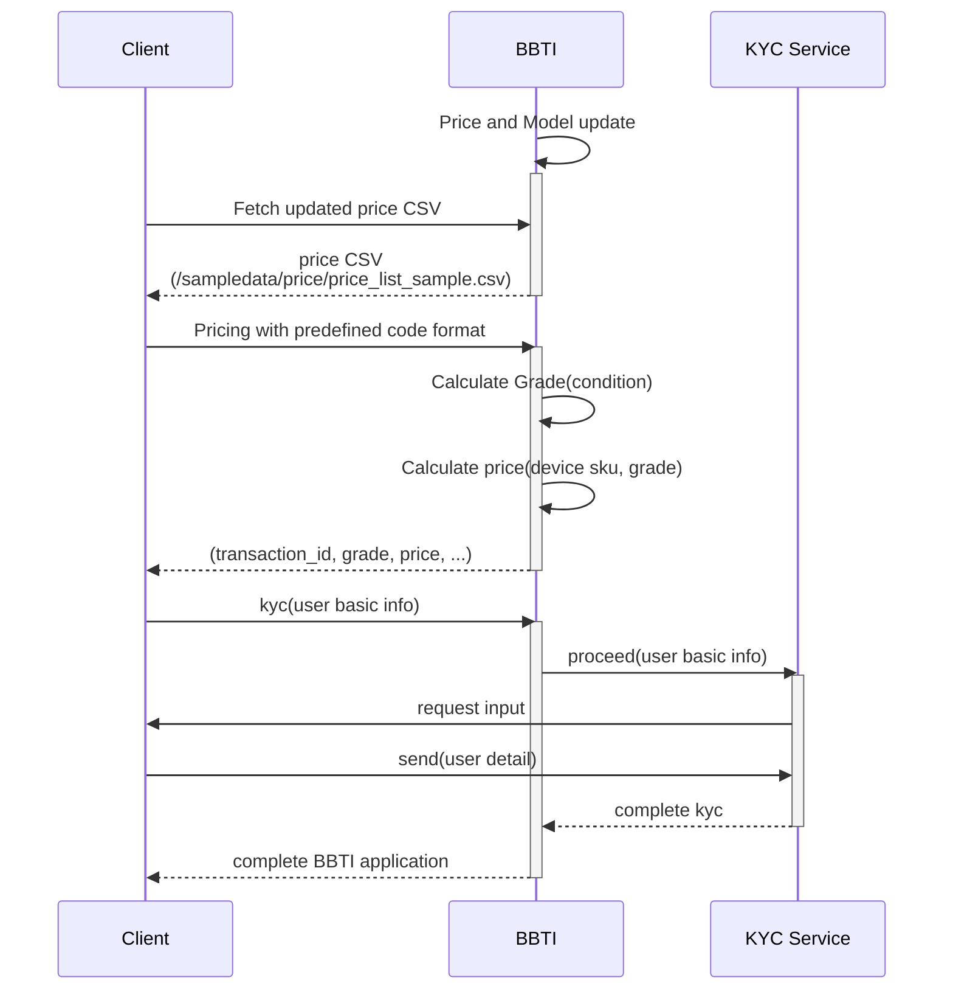

# AppCode API Call

## Sequence diagram

```mermaid
sequenceDiagram
  participant Client
  participant BBTI
  participant KYC Service
  
  BBTI->>BBTI: Price and Model update
  activate BBTI
    Client->>BBTI: Fetch updated price CSV
    BBTI-->>Client: price CSV<br>(/sampledata/price/price_list_sample.csv)
  deactivate BBTI
  Client->>BBTI: Pricing with predefined code format
  activate BBTI
    BBTI->>BBTI: Calculate Grade(condition)
    BBTI->>BBTI: Calculate price(device sku, grade)
    BBTI-->>Client: (transaction_id, grade, price, ...)
  deactivate BBTI
  Client->>BBTI: kyc(user basic info)
   activate BBTI
    BBTI->>KYC Service: proceed(user basic info)
    activate KYC Service
      KYC Service->>Client: request input
      Client ->> KYC Service: send(user detail) 
      KYC Service-->>BBTI: complete kyc
    deactivate KYC Service
    BBTI-->>Client: complete BBTI application
  deactivate BBTI
```
