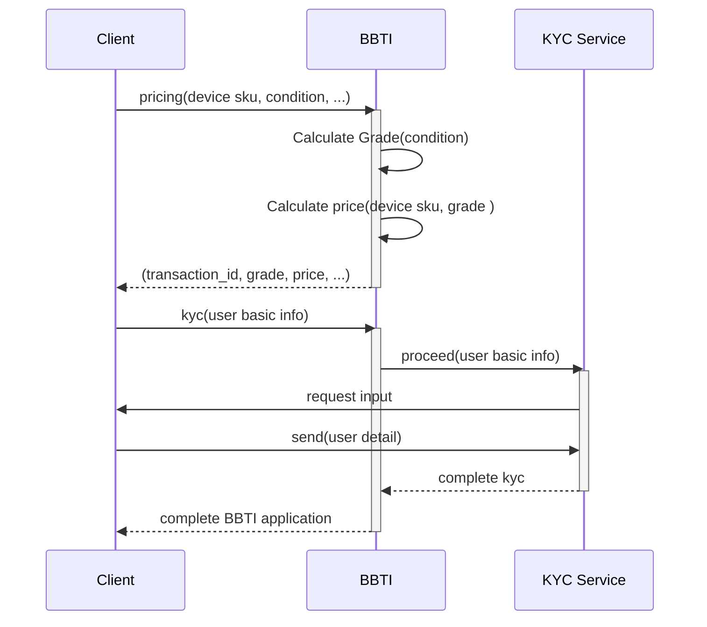

# Standard API Call

## Sequence diagram

```mermaid
sequenceDiagram
  Client->>BBTI: pricing(device sku, condition, ...)
  activate BBTI
    BBTI->>BBTI: Calculate Grade(condition)
    BBTI->>BBTI: Calculate price(device sku, grade )
    BBTI-->>Client: (transaction_id, grade, price, ...)
  deactivate BBTI
  Client->>BBTI: kyc(user basic info)
   activate BBTI
    BBTI->>KYC Service: proceed(user basic info)
    activate KYC Service
      KYC Service->>Client: request input
      Client ->> KYC Service: send(user detail) 
      KYC Service-->>BBTI: complete kyc
    deactivate KYC Service
    BBTI-->>Client: complete BBTI application
  deactivate BBTI
```